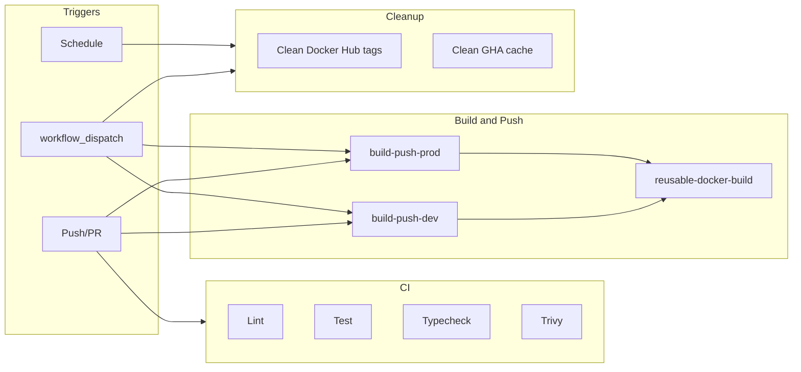

# CI/CD Pipeline Documentation

This pipeline **builds and pushes Docker images to Docker Hub only**. It does not deploy to any server, run SSH, or perform health checks. Deployment is handled separately (e.g. via Watchtower or your own deploy process).

## Overview

- **CI (`ci.yml`)**: Lint, test, typecheck, and Trivy security scan on every push and pull request. No Docker build.
- **Reusable build (`reusable-docker-build.yml`)**: Single job that builds one Docker image and pushes it to Docker Hub with configurable tags. Used by dev and prod workflows.
- **Dev build (`build-push-dev.yml`)**: Builds API and Web images for development on push to `develop`/`devlop` or manual run. Tags: `dev`, `dev-{commit_sha}`.
- **Prod build (`build-push-prod.yml`)**: Builds API and Web images for production on push to `main`/`master` or manual run. Requires manual approval (environment `prod-approval`) unless `skip_approval` is used. Tags: `prod`, `prod-{commit_sha}`, `latest`.
- **Cleanup (`cleanup.yml`)**: Weekly or manual. Deletes old Docker Hub tags (keeps `latest`, `prod`, `dev`) and old GitHub Actions cache entries.

## Architecture (build and push only)



---

## Workflows (detail)

### 1. CI (`ci.yml`)

- **Purpose:** Run lint, tests, type checking, and security scan. No Docker build or push.
- **Triggers:** Every `push` and every `pull_request` (all branches).
- **Jobs (conditional on changed paths):**
  - **changes:** Detects changes under `apps/api/**`, `apps/web/**`, `packages/**`.
  - **lint-api** / **lint-web:** Run when api/web or shared changed. Run `pnpm run lint` for the relevant app and shared.
  - **test-api** / **test-web:** Run when api/web or shared changed. Run `pnpm run test` (continue-on-error if no test script yet).
  - **typecheck:** Run when any of api/web/shared changed. Single `pnpm run check-types`.
  - **trivy:** Run when any of api/web/shared changed. Trivy filesystem scan (CRITICAL/HIGH); results uploaded as SARIF.
- **Concurrency:** One run per branch; newer runs cancel in-progress.

### 2. Reusable Docker Build (`reusable-docker-build.yml`)

- **Purpose:** Build one image and push to Docker Hub. Used by dev and prod workflows.
- **Type:** `workflow_call` (called by other workflows).
- **Inputs:** `image_name`, `dockerfile_path`, `environment` (dev|prod), `app_name`, `commit_sha`, `ref` (git ref to checkout), `create_env_file` (boolean), `env_content` (optional; for web app .env).
- **Secrets (passed by caller):** `DOCKERHUB_USERNAME`, `DOCKERHUB_TOKEN`.
- **Steps:** Checkout at `ref`, optionally write `apps/web/.env` from `env_content`, Docker Buildx, login to Docker Hub, build and push. Tags: `{image_name}:{environment}`, `{image_name}:{environment}-{commit_sha}`; for `environment == 'prod'` also `{image_name}:latest`. Uses GHA cache.

### 3. Build and Push – Dev (`build-push-dev.yml`)

- **Purpose:** Build and push dev images. No deployment.
- **Triggers:**
  - Push to `develop` or `devlop`
  - Closed (merged) PR targeting `develop` or `devlop`
  - Manual: **Actions → Build and Push (Dev) → Run workflow**
- **Manual inputs:** `deploy_api`, `deploy_web`, `force_deploy` (booleans; control which images to build).
- **Jobs:** Detect changes; call reusable workflow for API and/or Web when api/web/shared changed or when manual flags/force_deploy are set. Tags: `dev`, `dev-{commit_sha}`.
- **Concurrency:** One dev build per ref at a time.

### 4. Build and Push – Prod (`build-push-prod.yml`)

- **Purpose:** Build and push prod images. No deployment.
- **Triggers:**
  - Push to `main` or `master`
  - Closed (merged) PR targeting `main` or `master`
  - Manual: **Actions → Build and Push (Prod) → Run workflow**
- **Manual inputs:** `deploy_api`, `deploy_web`, `force_deploy`, `skip_approval` (booleans).
- **Approval:** Jobs that build images use environment **prod-approval**. Configure required reviewers in **Settings → Environments → prod-approval**. When `skip_approval` is true, build jobs run without that environment (no approval step).
- **Jobs:** Same change detection as dev; build API and Web via reusable workflow. Tags: `prod`, `prod-{commit_sha}`, `latest`.
- **Concurrency:** One prod build per ref at a time.

### 5. Cleanup (`cleanup.yml`)

- **Purpose:** Remove old Docker Hub tags and old GitHub Actions caches. No deployment.
- **Triggers:** Weekly (Sunday 02:00 UTC), or manual: **Actions → Cleanup → Run workflow**.
- **Manual inputs:** `days_to_keep` (default 30), `dry_run` (default true). When `dry_run` is true, only list what would be deleted. Scheduled runs perform deletes (no dry run).
- **Jobs:**
  - **clean-docker-hub:** List tags for `dev-api-ims` and `dev-web-ims` via Docker Hub API; delete tags older than `days_to_keep`; never delete `latest`, `prod`, or `dev`.
  - **clean-actions-cache:** Delete repository caches older than 7 days (via GitHub API).

---

## Triggers and usage

| Branch / event             | What runs                                                |
| -------------------------- | -------------------------------------------------------- |
| Push / PR (any branch)     | CI (lint, test, typecheck, Trivy)                        |
| Push to `develop`/`devlop` | CI + Build and Push (Dev) (change-based)                 |
| Push to `main`/`master`    | CI + Build and Push (Prod) (change-based, then approval) |
| Merged PR → develop/devlop | Build and Push (Dev) for merge commit                    |
| Merged PR → main/master    | Build and Push (Prod) for merge commit                   |
| Manual                     | Build and Push (Dev/Prod) or Cleanup with chosen inputs  |

---

## Manual build instructions

1. Go to **Actions** in the repo.
2. Select **Build and Push (Dev)** or **Build and Push (Prod)**.
3. Click **Run workflow**, choose branch, set:
   - **deploy_api** / **deploy_web:** which images to build.
   - **force_deploy:** build both even if no changes.
   - **skip_approval** (prod only): skip manual approval (use with caution).
4. Click **Run workflow**. For prod (without skip_approval), approve when the **prod-approval** step waits.

---

## Image naming and tagging

- **Names:** `{DOCKERHUB_USERNAME}/dev-api-ims`, `{DOCKERHUB_USERNAME}/dev-web-ims`.
- **Tags:**
  - Dev: `dev`, `dev-{full_commit_sha}`.
  - Prod: `prod`, `prod-{full_commit_sha}`, `latest`.

---

## Required secrets and variables

**Repository secrets (Settings → Secrets and variables → Actions):**

- **DOCKERHUB_USERNAME:** Docker Hub username.
- **DOCKERHUB_TOKEN:** Docker Hub access token (read/write).

**Repository variables:**

- **DEV_UI:** Content for `apps/web/.env` when building the web image from dev (e.g. `NEXT_PUBLIC_API_URL=...`).
- **PROD_UI:** Same for prod web builds.

**Environment:**

- **prod-approval:** Create under **Settings → Environments**. Add required reviewers so production builds wait for approval before running.

Optional: you can use a secret **ENV_CONTENT** and pass it as `env_content` from a caller if you prefer not to use variables.

---

## Common workflows

- **Open a PR:** CI runs (lint, test, typecheck, Trivy). No images built.
- **Merge to develop:** Dev images built and pushed (only if api/web/packages changed). No deployment.
- **Merge to main:** Prod build runs; after approval, prod images built and pushed. No deployment.
- **Manual dev build:** Run **Build and Push (Dev)** with branch and options; images pushed to Docker Hub.
- **Weekly cleanup:** Cleanup runs on schedule; old tags and cache entries removed (or run manually with `dry_run: false`).

---

## Using the built images

After the pipeline pushes images, pull and run them from any host that can reach Docker Hub (e.g. your server or local machine):

```bash
# Pull
docker pull $DOCKERHUB_USERNAME/dev-api-ims:dev
docker pull $DOCKERHUB_USERNAME/dev-web-ims:prod

# Run (example; set env vars and ports as needed)
docker run -d -p 4000:4000 -e DATABASE_URL=... $DOCKERHUB_USERNAME/dev-api-ims:prod
docker run -d -p 3000:3000 -e NEXT_PUBLIC_API_URL=... $DOCKERHUB_USERNAME/dev-web-ims:prod
```

See **QUICK-REFERENCE.md** for more `docker run` and docker-compose examples. Deployment to your servers is outside this pipeline (e.g. use `deploy/` or your own process).

---

## Troubleshooting

- **Build not running for my push:** Check change detection: only changes under `apps/api/**`, `apps/web/**`, or `packages/**` trigger API/Web builds. Use manual run with **force_deploy** to build anyway.
- **Build failed (Dockerfile/cache):** Check the **Reusable Docker Build** job logs. Fix Dockerfile or clear cache (e.g. change cache key or run cleanup).
- **Push failed (unauthorized):** Verify **DOCKERHUB_USERNAME** and **DOCKERHUB_TOKEN** (token must have read/write). No 2FA on token if you use password; prefer access token.
- **Prod build not waiting for approval:** Ensure environment **prod-approval** exists and has required reviewers. Build jobs must use that environment when `skip_approval` is false.
- **Cleanup not deleting tags:** Ensure **days_to_keep** and tag age logic match. Protected tags (`latest`, `prod`, `dev`) are never deleted. Run with **dry_run: false** for manual cleanup to actually delete.
- **Trivy failing:** Adjust severity or ignore unfixed in `ci.yml` (Trivy step), or fix reported issues in dependencies/Dockerfiles.
