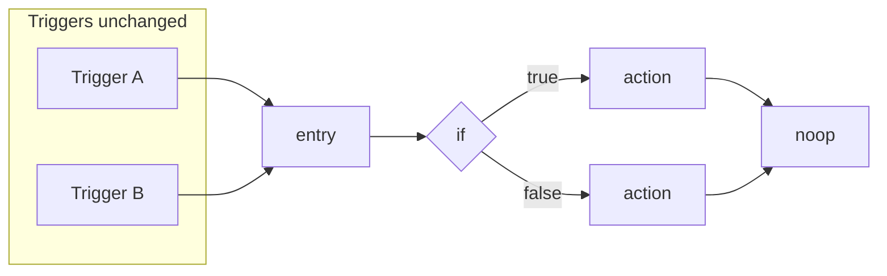

# Specification: Event automation branching (Phase 3)

| Field          | Value                                                                                                       |
| -------------- | ----------------------------------------------------------------------------------------------------------- |
| **Status**     | Draft — implementation pending                                                                              |
| **Audience**   | Backend, frontend, product, QA                                                                              |
| **Scope**      | `AutomationDefinition` (event automations) only; excludes CRM `PipelineWorkflow`                            |
| **Supersedes** | Informal notes in [`automation-branching-future.md`](./automation-branching-future.md) for normative detail |

### Executive summary

This specification defines a **directed acyclic graph (DAG)** representation for automation bodies, adding **`if`** and **`switch`** routing while preserving today’s **trigger model**, **action handlers**, **LIVE/SHADOW** execution, and **tenant-scoped** behavior. Execution remains **strictly single-path** per run (no parallel branches or merge nodes in version 1). User-facing branch nodes and messaging **must not** ship until validation, runtime, persistence, tests, and run-history UX described herein are complete and protected by an explicit environment flag.

### Conformance

The key words **MUST**, **MUST NOT**, **SHOULD**, **SHOULD NOT**, and **MAY** are to be interpreted as described in [RFC 2119](https://www.rfc-editor.org/rfc/rfc2119).

### References (current implementation)

- Runtime: [`apps/api/src/modules/automation/automation.runtime.ts`](../../apps/api/src/modules/automation/automation.runtime.ts)
- Schemas: [`apps/api/src/modules/automation/automation.schema.ts`](../../apps/api/src/modules/automation/automation.schema.ts)
- Persistence: [`apps/api/prisma/schema.prisma`](../../apps/api/prisma/schema.prisma) — `AutomationDefinition`, `AutomationStep`, `AutomationRun`, `AutomationRunStep`
- Visual builder (linear today): [`AutomationFlowCanvas.tsx`](../../apps/web/features/automation/components/AutomationFlowCanvas.tsx)

---

## 1. Terminology

| Term                    | Definition                                                                                                                                                                    |
| ----------------------- | ----------------------------------------------------------------------------------------------------------------------------------------------------------------------------- |
| **Graph body**          | The DAG of nodes and edges executed after triggers match; distinct from `AutomationTrigger[]`.                                                                                |
| **Linear definition**   | Definition with ordered `AutomationStep` rows and no persisted graph (today’s default).                                                                                       |
| **Branch decision**     | The outcome of evaluating an `if` (`true` / `false`) or `switch` (case key including `default`) at a given node for a given run.                                              |
| **Frozen path**         | Branch decisions recorded on first evaluation for a run **MUST NOT** change on resume, even if the event payload changes.                                                     |
| **Terminal node**       | A node with no outgoing edges. Run **outcome** (succeeded vs failed) is determined by **action** results and `continueOnError`, not merely by reaching a terminal (see §7.1). |
| **Scalar discriminant** | A resolved value that is `null`, `boolean`, `number`, or `string` only — not an object or array.                                                                              |

---

## 2. Requirements traceability

| ID    | Statement                                                                                                                                                                                                                                                                                                                                                                                                                                                                                                                    |
| ----- | ---------------------------------------------------------------------------------------------------------------------------------------------------------------------------------------------------------------------------------------------------------------------------------------------------------------------------------------------------------------------------------------------------------------------------------------------------------------------------------------------------------------------------- |
| BR-01 | Branching **MUST** apply only to event `AutomationDefinition`; CRM pipeline workflows are out of scope for this spec.                                                                                                                                                                                                                                                                                                                                                                                                        |
| BR-02 | The graph **MUST** be a **DAG** (no cycles).                                                                                                                                                                                                                                                                                                                                                                                                                                                                                 |
| BR-03 | There **MUST** be exactly one `entry` node with no incoming edges.                                                                                                                                                                                                                                                                                                                                                                                                                                                           |
| BR-04 | Every `action` node **MUST** be reachable from `entry`.                                                                                                                                                                                                                                                                                                                                                                                                                                                                      |
| BR-05 | An `if` node **MUST** have exactly two outgoing edges labeled `true` and `false`.                                                                                                                                                                                                                                                                                                                                                                                                                                            |
| BR-06 | A `switch` node **MUST** have at least two outgoing edges with distinct keys; at most one **MAY** be `default`. Implementations **SHOULD** require a `default` edge at validation time to avoid ambiguous runtime failure.                                                                                                                                                                                                                                                                                                   |
| BR-07 | `entry` and `noop` nodes that are not terminal **MUST** have exactly one outgoing edge (simplifies the walker).                                                                                                                                                                                                                                                                                                                                                                                                              |
| BR-08 | Per-run execution **MUST** follow at most one outgoing edge at each routing node (no parallel fan-out in v1).                                                                                                                                                                                                                                                                                                                                                                                                                |
| BR-09 | Condition evaluation on `if` **MUST** reuse the same condition shape and AND semantics as existing trigger conditions (`AutomationCondition[]`), evaluated against `RuntimeContext` (including templating consistent with `renderTemplateValue`).                                                                                                                                                                                                                                                                            |
| BR-10 | Each `action` node’s `actionType` **MUST** be permitted for at least one trigger on the definition (reuse `isAutomationActionAllowedForEvent` or equivalent).                                                                                                                                                                                                                                                                                                                                                                |
| BR-11 | Graph size and branching **MUST** respect implementation limits (defaults: 64 nodes, 128 edges, 16 conditions per `if`, 32 `switch` cases).                                                                                                                                                                                                                                                                                                                                                                                  |
| BR-12 | String fields embedded in configs **MUST** obey the same template whitelist rules as the linear automation path today.                                                                                                                                                                                                                                                                                                                                                                                                       |
| BR-13 | LIVE runs **MUST** apply real side effects only for visited `action` nodes. SHADOW runs **MUST** preview actions using the same preview mechanism as today (`buildShadowStepPreview`); SHADOW **MUST NOT** simulate all outgoing branches of every routing node (single chosen path only).                                                                                                                                                                                                                                   |
| BR-14 | For graph-backed runs, `AutomationRunStep` (or equivalent) **MUST** support association to a graph node via nullable `graphNodeId` (foreign key). Synthetic `AutomationStep` rows for non-action nodes are **NOT** recommended.                                                                                                                                                                                                                                                                                              |
| BR-15 | Uniqueness: for a given run, at most one run-step row per `graphNodeId` **SHOULD** hold when that node is an executed `action`.                                                                                                                                                                                                                                                                                                                                                                                              |
| BR-16 | Resume **MUST** persist sufficient state (`cursorNodeId`, `branchDecisions`) so that continuation follows the **frozen path**; branch decisions **MUST NOT** be re-derived from payload on resume.                                                                                                                                                                                                                                                                                                                           |
| BR-17 | UI surfaces that advertise conditional branching (palette nodes, marketing copy) **MUST NOT** ship until backend conformance, automated tests, run-history UX for skipped arms, and env flag `AUTOMATION_BRANCHING` (in addition to any visual-builder flag) are in place.                                                                                                                                                                                                                                                   |
| BR-18 | An `if` node **MUST** include at least one condition; `conditions` **MUST NOT** be an empty array at validation time (vacuous truth is forbidden — it would hide authoring mistakes).                                                                                                                                                                                                                                                                                                                                        |
| BR-19 | For the same definition version, the API **MUST NOT** accept a persisted graph body and a non-empty set of legacy `AutomationStep` rows together; reject the request or normalize in one transaction — **MUST NOT** leave both authoritative without a defined merge rule.                                                                                                                                                                                                                                                   |
| BR-20 | Every edge **MUST** reference node ids that exist on that definition; dangling or cross-definition references **MUST** be rejected at validation.                                                                                                                                                                                                                                                                                                                                                                            |
| BR-21 | Outgoing edges from a `switch` node **MUST** have a **stable, documented total order** (e.g. array order in JSON, or an explicit `order` integer on edges) so “first match” is deterministic across runtimes and releases.                                                                                                                                                                                                                                                                                                   |
| BR-22 | `switch` discriminant resolution **MUST** produce a **scalar discriminant** (see §1). If resolution fails (missing path, template error), or the value is an **object** or **array**, the run **MUST** transition to **failed** before selecting an edge (no silent coercion to string for structured values).                                                                                                                                                                                                               |
| BR-23 | `entry` **MUST** have at least one outgoing edge (it **MUST NOT** be terminal). A graph with no `action` nodes **SHOULD** be rejected at validation as non-actionable unless product explicitly allows routing-only definitions.                                                                                                                                                                                                                                                                                             |
| BR-24 | Run **outcome** for graph execution **MUST** match linear semantics: if any executed `action` fails and that node’s `continueOnError` is false, the run **MUST** end in **failed**; reaching a terminal does not override an earlier hard failure. If `continueOnError` is true, the walker **MUST** advance to the **unique** successor when present (§7.1). Any difference from the linear executor’s error taxonomy (e.g. non-retriable classes) **MUST** be documented as an explicit parity note in the implementation. |
| BR-25 | Optional: implementations **MAY** append routing nodes to the path log or a separate audit stream without creating mutating `AutomationRunStep` rows; if they do, ordering **MUST** match visit order for replay debugging.                                                                                                                                                                                                                                                                                                  |

---

## 3. Decision summary

| Topic            | Decision                                                                                                                                                                                                                                                                                                        |
| ---------------- | --------------------------------------------------------------------------------------------------------------------------------------------------------------------------------------------------------------------------------------------------------------------------------------------------------------- |
| Topology         | DAG; single active path per run; no merge/join in v1                                                                                                                                                                                                                                                            |
| Triggers         | Unchanged; single `entry` as graph root                                                                                                                                                                                                                                                                         |
| `if`             | `conditions: AutomationCondition[]` — conjunction (AND); OR via multiple nodes or a future `conditionGroups` extension                                                                                                                                                                                          |
| `switch`         | Scalar from `discriminantPath`; first matching edge, else `default`                                                                                                                                                                                                                                             |
| Persistence      | **Option A:** `AutomationGraphNode` + `AutomationGraphEdge` tables. **Option B:** `AutomationDefinition.flowGraph` JSON. Record the chosen option in the implementing PR or ADR; Option A is recommended for production; Option B is acceptable for a time-boxed spike behind a flag with a migration path to A |
| Linear legacy    | No persisted graph: execute via existing linear ordering **or** compile once to an in-memory DAG (`entry` → actions → `noop`)                                                                                                                                                                                   |
| Coexistence      | Persisted graph + non-empty legacy `AutomationStep` rows for the same version **MUST NOT** both be accepted (BR-19). When only a graph exists, it is the source of truth; `AutomationStep` rows **SHOULD** be empty for that version                                                                            |
| Observability    | Optional ordered path log: `{ nodeId, edgeKey?, timestamp }`                                                                                                                                                                                                                                                    |
| Safety           | Walker **SHOULD** abort if `visitedCount` exceeds approximately `2 × MAX_GRAPH_NODES`                                                                                                                                                                                                                           |
| Excluded from v1 | Arbitrary code or embedded expressions in conditions; sub-workflows / call-automation; parallel fan-out with merge/join                                                                                                                                                                                         |

---

## 4. Baseline: linear execution (informative)

Today: `AutomationStep` rows ordered by `stepOrder`; runtime iterates in order. `RuntimeContext` exposes `event`, `outputs` keyed by step id, and `lastOutput`. `continueOnError` is per step. `AutomationRunStep` references `automationStepId`. Resume assumes a linear progression.

Branching introduces: (a) a subset of nodes visited per run, (b) requirement for an auditable **chosen path** and visible **skipped** arms in UX, (c) resume state that is not reducible to a single integer index.

---

## 5. Graph model (normative)

After triggers match, execution begins at **`entry`** and moves along edges until a terminal node.

### 5.1 Node kinds

| Kind     | Configuration                                                                    | Mutating / side effects           |
| -------- | -------------------------------------------------------------------------------- | --------------------------------- |
| `entry`  | None                                                                             | No                                |
| `noop`   | None (junction or explicit end)                                                  | No                                |
| `action` | `actionType`, `actionConfig`, `continueOnError` (same semantics as today’s step) | Yes (LIVE); preview only (SHADOW) |
| `if`     | `conditions: AutomationCondition[]`                                              | No                                |
| `switch` | `discriminantPath` resolving to a scalar in context                              | No                                |

**Future extension (non-normative for v1):** `merge` / parallel fork with barrier semantics, idempotency keys, and extended run-step modeling — only if product requirements justify the complexity.

### 5.2 Edges

- An edge connects `fromNodeId` to `toNodeId` and **MAY** carry `edgeKey` (string).
- **`if`:** exactly two outgoing edges with keys `true` and `false`.
- **`switch`:** outgoing edges carry distinct keys; at most one `default`. **Match order:** evaluate non-`default` edges in **stable order** (BR-21); the first edge whose key **matches** the discriminant wins. **Matching rule (normative):** coerce both the discriminant and the edge key with `String(...)` after the discriminant is verified as a scalar (BR-22). Examples: number `1` matches edge key `"1"`; boolean `true` matches `"true"`; `null` matches `"null"` (JavaScript `String(null)`). **If no key matches** and a `default` edge exists, follow `default`. **If no key matches and no `default`**, the run **MUST** fail (validation **SHOULD** require `default` to prevent this).

---

## 6. Validation

Implement validation in shared Zod (e.g. `packages/shared/.../automation-flow-graph.schema.ts`) and enforce at API boundaries before persistence. Wire-up to create/update endpoints **SHOULD** occur in the same release train as runtime support, or behind a single feature flag.

| #    | Invariant                                                                               |
| ---- | --------------------------------------------------------------------------------------- |
| V-1  | Acyclic graph (topological order or cycle detection)                                    |
| V-2  | Exactly one `entry`, in-degree zero                                                     |
| V-3  | All `action` nodes reachable from `entry`                                               |
| V-4  | `if` / `switch` edge shapes per §5.2                                                    |
| V-5  | Action/trigger allowlist (BR-10)                                                        |
| V-6  | Numeric limits (BR-11)                                                                  |
| V-7  | Template whitelist on configurable strings (BR-12)                                      |
| V-8  | `if`: `conditions.length ≥ 1` (BR-18)                                                   |
| V-9  | All edges reference existing in-graph node ids (BR-20)                                  |
| V-10 | `entry` has ≥ 1 outgoing edge (BR-23)                                                   |
| V-11 | Coexistence: no persisted graph + non-empty legacy steps (BR-19)                        |
| V-12 | `switch`: non-`default` edge keys unique; stable edge order stored or derivable (BR-21) |

---

## 7. Runtime algorithm

**State:** `RuntimeContext` (unchanged contract); for graph runs, `outputs` and `lastOutput` refer to **graph node ids**. `currentNodeId` initializes to `entry`. Maintain `visitedCount` for termination safety.

**Transition table:**

| Node kind       | Behavior                                                                                                                            |
| --------------- | ----------------------------------------------------------------------------------------------------------------------------------- |
| `entry`, `noop` | If no outgoing edge: run completes successfully (subject to prior failures). Otherwise advance to the unique successor.             |
| `if`            | Evaluate conditions; select `true` or `false` edge; record **branch decision** for BR-16.                                           |
| `switch`        | Resolve discriminant; select first matching edge or `default`; record decision.                                                     |
| `action`        | Persist/run `AutomationRunStep` keyed by `graphNodeId`; invoke handler; update `outputs` and `lastOutput`; honor `continueOnError`. |

**LIVE:** production side effects on `action` nodes only. **SHADOW:** use existing preview for `action`; for routing nodes, record the **would-take** edge only. A separate **development-only** mode that simulates all branches **MAY** be introduced later and **MUST NOT** be enabled in production SHADOW by default.

**Parallelism:** at most one outgoing path per routing node (BR-08).

### 7.1 Completion and failure semantics

- **Terminal reached:** the walker arrives at a node with no outgoing edges. That alone does **not** imply success if a prior `action` already marked the run failed under linear rules (BR-24).
- **`continueOnError`:** identical intent as today: on `action` failure, either stop the run (false) or continue to the unique successor (true), if the graph provides one; graphs **SHOULD** ensure every `action` with `continueOnError: true` has exactly one outgoing edge so continuation is unambiguous.
- **Routing nodes** (`if`, `switch`): evaluation errors (condition evaluation, discriminant resolution) **MUST** fail the run; they **MUST NOT** write mutating `AutomationRunStep` rows.

---

## 8. Persistence, resume, migration

### 8.1 Run records

Add nullable `graphNodeId` (FK to graph node table, or stable id within versioned JSON graph) on `AutomationRunStep`. Prefer `(automationRunId, graphNodeId)` uniqueness for executed action nodes.

Store a nullable **`flowGraphSnapshot`** (JSON) on **`AutomationRun`**: a copy of the definition’s `flowGraph` at run start. Graph resume **MUST** load the DAG from `flowGraphSnapshot` when set; otherwise fall back to the definition’s current `flowGraph` (legacy runs only — may diverge after edits).

### 8.2 Resume

On failure or intentional pause, persist `cursorNodeId` and a serializable `branchDecisions` map (including `switch` outcomes). On resume, advance along the **frozen path** from the cursor; **do not** re-evaluate routing from scratch (BR-16). Operators **SHOULD** document idempotency expectations for retried actions (inherited constraint from linear automations).

**Edge cases:** Persist **branch decision and cursor** in the same transactional unit when possible so a crash cannot leave “decision taken” without an advanced cursor (or vice versa). **Implementation:** LIVE graph runs store `branchDecisions` and optional `cursorNodeId` under `stepOutput.__automationGraph`; when the next node after routing is an **`action`**, the run’s `stepOutput` update and the new `AutomationRunStep` (RUNNING) for that action are written in **one** DB transaction. Routing-to-non-action paths use an immediate checkpoint `updateRun` only. If resume starts at a **routing** node with no prior recorded decision for that node, **MUST** treat as corrupt state and fail the resume (do not guess). **Definition versioning:** resumed runs **MUST** execute against the **graph version bound at run start**; `graphNodeId` and `branchDecisions` **MUST** refer to that version, not the latest edited definition.

### 8.3 Migration

1. **Read path:** definitions without a graph continue to use the linear executor or a one-shot in-memory compilation to a canonical DAG.
2. **Optional data migration:** batch-create graph rows or JSON from existing steps; bump definition version where applicable.
3. **API:** during transition, accept legacy payloads; server normalizes to a single canonical internal representation.

---

## 9. Product and engineering gates

The following **SHALL** be satisfied before exposing branch nodes in [`AutomationFlowCanvas`](../../apps/web/features/automation/components/AutomationFlowCanvas.tsx) or equivalent:

- [ ] Create/update paths validate graph payloads (§6).
- [ ] LIVE and SHADOW graph execution covered by automated tests.
- [ ] Run detail UI surfaces **chosen path** and **skipped** subgraphs in a user-comprehensible manner.
- [ ] Resume behavior documented for operators and enforced in code (§8.2).
- [ ] `AUTOMATION_BRANCHING` environment flag enforced in API and UI, additive to the visual builder flag.
- [ ] User-facing copy updated wherever “steps always run in order” is no longer accurate.

---

## 10. Test catalog (individual cases)

Each row is one automatable case. **Trace** maps to §2 (BR / V), §14 (EC), or §6 (V-\*). **Layer:** `U` unit (Zod/pure), `I` integration (API + DB or runtime + DB), `E` E2E (browser + API). Implementations **MAY** cover one row with multiple assertions in a single test file if the name references the row **ID**.

**Inventory:** **29** validation cases (AT-VAL-001–029), **18** LIVE runtime cases (AT-LIV-001–018), **4** SHADOW cases (AT-SHD-001–004), **5** resume / versioning cases (AT-RSU-001–005), **3** migration cases (AT-MIG-001–003), **3** UI / flag cases (AT-UI-001–003), plus **17** §14 acceptance aliases (AT-EC-001–017) that point at the canonical rows above — **79** numbered rows total, **62** canonical implementations if aliases are satisfied by tagged tests only.

### 10.1 Validation — graph shape and invariants

| ID         | Layer | Trace              | Description                                                                                                                                              | Expected                                                         |
| ---------- | ----- | ------------------ | -------------------------------------------------------------------------------------------------------------------------------------------------------- | ---------------------------------------------------------------- |
| AT-VAL-001 | U     | V-1                | Persisted graph contains a directed cycle                                                                                                                | Rejected at validation                                           |
| AT-VAL-002 | U     | V-2, BR-03         | No node has `kind === "entry"`                                                                                                                           | Rejected                                                         |
| AT-VAL-003 | U     | V-2, BR-03         | Two or more nodes have `kind === "entry"`                                                                                                                | Rejected                                                         |
| AT-VAL-004 | U     | V-2, BR-03         | The unique `entry` has at least one incoming edge                                                                                                        | Rejected                                                         |
| AT-VAL-005 | U     | V-3, BR-04         | An `action` node exists with no path from `entry`                                                                                                        | Rejected                                                         |
| AT-VAL-006 | U     | V-10, BR-23, EC-06 | `entry` has zero outgoing edges                                                                                                                          | Rejected                                                         |
| AT-VAL-007 | U     | BR-07              | Non-terminal `entry` has more than one outgoing edge                                                                                                     | Rejected                                                         |
| AT-VAL-008 | U     | BR-07              | Non-terminal `noop` has zero outgoing edges                                                                                                              | Rejected                                                         |
| AT-VAL-009 | U     | BR-07              | Non-terminal `noop` has more than one outgoing edge                                                                                                      | Rejected                                                         |
| AT-VAL-010 | U     | V-4, BR-05, EC-17  | `if` node has fewer than two outgoing edges                                                                                                              | Rejected                                                         |
| AT-VAL-011 | U     | V-4, BR-05, EC-17  | `if` node has more than two outgoing edges                                                                                                               | Rejected                                                         |
| AT-VAL-012 | U     | V-4, BR-05, EC-17  | `if` outgoing edges are not keyed exactly `true` and `false` (missing or wrong labels)                                                                   | Rejected                                                         |
| AT-VAL-013 | U     | V-4, BR-06         | `switch` node has fewer than two outgoing edges                                                                                                          | Rejected                                                         |
| AT-VAL-014 | U     | V-4, BR-06         | `switch` has more than one edge with key `default`                                                                                                       | Rejected                                                         |
| AT-VAL-015 | U     | V-4, V-12, EC-13   | `switch` has duplicate non-`default` edge keys                                                                                                           | Rejected                                                         |
| AT-VAL-016 | U     | V-9, BR-20         | Edge `fromNodeId` references unknown node id                                                                                                             | Rejected                                                         |
| AT-VAL-017 | U     | V-9, BR-20         | Edge `toNodeId` references unknown node id                                                                                                               | Rejected                                                         |
| AT-VAL-018 | U     | V-8, BR-18, EC-01  | `if` with `conditions: []`                                                                                                                               | Rejected                                                         |
| AT-VAL-019 | U     | V-11, BR-19, EC-05 | Same definition version: persisted graph body and non-empty legacy `AutomationStep` rows together                                                        | Rejected (or single-transaction normalize to one authority only) |
| AT-VAL-020 | U     | V-5, BR-10         | `action` node uses `actionType` not allowed for any trigger on the definition                                                                            | Rejected                                                         |
| AT-VAL-021 | U     | V-6, BR-11         | Node count exceeds `MAX_GRAPH_NODES`                                                                                                                     | Rejected                                                         |
| AT-VAL-022 | U     | V-6, BR-11         | Edge count exceeds `MAX_GRAPH_EDGES`                                                                                                                     | Rejected                                                         |
| AT-VAL-023 | U     | V-6, BR-11         | `if` has more than `MAX_CONDITIONS_PER_IF` conditions                                                                                                    | Rejected                                                         |
| AT-VAL-024 | U     | V-6, BR-11         | `switch` has more than `MAX_SWITCH_CASES` outgoing edges                                                                                                 | Rejected                                                         |
| AT-VAL-025 | U     | V-7, BR-12         | Config string on a graph node violates template whitelist                                                                                                | Rejected                                                         |
| AT-VAL-026 | U     | BR-23, EC-07, V-3  | Graph has zero `action` nodes (when product policy rejects routing-only definitions)                                                                     | Rejected                                                         |
| AT-VAL-027 | U     | EC-08, §7.1        | `action` with `continueOnError: true` has zero outgoing edges (when policy forbids ambiguous continuation)                                               | Rejected                                                         |
| AT-VAL-028 | U     | EC-08, §7.1        | `action` with `continueOnError: true` has more than one outgoing edge (when policy forbids ambiguous continuation)                                       | Rejected                                                         |
| AT-VAL-029 | U     | V-12, BR-21        | `switch` edges omit required ordering when implementation uses explicit `order` (or JSON array order is canonical and test asserts round-trip stability) | Rejected or deterministic order documented in test               |

### 10.2 Runtime — LIVE

| ID         | Layer | Trace        | Description                                                                   | Expected                                                                                      |
| ---------- | ----- | ------------ | ----------------------------------------------------------------------------- | --------------------------------------------------------------------------------------------- |
| AT-LIV-001 | I     | BR-08, BR-09 | All `if` conditions pass                                                      | Walker follows `true` edge; downstream nodes on that path execute                             |
| AT-LIV-002 | I     | BR-09        | At least one `if` condition fails                                             | Walker follows `false` edge                                                                   |
| AT-LIV-003 | I     | BR-21, §5.2  | `switch` discriminant matches second non-`default` key in stored order        | Second key’s branch runs (proves order, not first-only bug)                                   |
| AT-LIV-004 | I     | §5.2, EC-04  | Discriminant is number `1`, edge key string `"1"`                             | Branches to that edge after `String()` coercion                                               |
| AT-LIV-005 | I     | §5.2         | Discriminant is `null`, edge key `"null"` (`String(null)` semantics)          | That edge is selected                                                                         |
| AT-LIV-006 | I     | §5.2         | Discriminant is boolean `true`, edge key `"true"`                             | That edge is selected                                                                         |
| AT-LIV-007 | I     | §5.2         | Discriminant matches no non-`default` key; `default` exists                   | `default` branch runs                                                                         |
| AT-LIV-008 | I     | EC-03, §5.2  | Discriminant matches no key; no `default` (if validation allows)              | Run ends **failed** before completing graph                                                   |
| AT-LIV-009 | I     | BR-22, EC-02 | Discriminant resolves to a plain object                                       | Run **failed** before edge selection                                                          |
| AT-LIV-010 | I     | BR-22, EC-02 | Discriminant resolves to an array                                             | Run **failed** before edge selection                                                          |
| AT-LIV-011 | I     | BR-22, EC-02 | Discriminant path missing or template evaluation throws                       | Run **failed** before edge selection                                                          |
| AT-LIV-012 | I     | EC-16, §7.1  | `if` condition evaluation throws                                              | Run **failed** at that node; no branch side effects after                                     |
| AT-LIV-013 | I     | BR-24, EC-09 | `action` fails with `continueOnError: false`                                  | Run **failed**; walker stops; sibling branch not taken                                        |
| AT-LIV-014 | I     | BR-24, §7.1  | `action` fails with `continueOnError: true` and exactly one successor         | Walker continues along that successor                                                         |
| AT-LIV-015 | I     | BR-24, EC-10 | Soft-failed `action` (`continueOnError: true`), then terminal reached         | Final status matches linear automation policy (document expected: success vs partial failure) |
| AT-LIV-016 | I     | §3, BR-11    | Walker `visitedCount` exceeds safety cap (fault injection or malicious graph) | Run aborted / failed per implementation guard                                                 |
| AT-LIV-017 | I     | BR-14, BR-15 | Two distinct `action` nodes on path both execute                              | Two `AutomationRunStep` rows with distinct `graphNodeId` when policy creates per-action rows  |
| AT-LIV-018 | I     | EC-14        | Non-`default` key matches; `default` also present earlier/later in storage    | Non-`default` wins per stable order; `default` not taken                                      |

### 10.3 Runtime — SHADOW

| ID         | Layer | Trace | Description                                     | Expected                                                                             |
| ---------- | ----- | ----- | ----------------------------------------------- | ------------------------------------------------------------------------------------ |
| AT-SHD-001 | I     | BR-13 | SHADOW run through `if` → `true` path           | Only actions on that path receive preview; sibling branch actions not previewed      |
| AT-SHD-002 | I     | BR-13 | SHADOW run                                      | No LIVE side effects (same assertion style as linear SHADOW today)                   |
| AT-SHD-003 | I     | BR-13 | SHADOW passes `switch`                          | Single chosen path only; metadata records chosen edge key where applicable           |
| AT-SHD-004 | I     | BR-13 | SHADOW through `if` with sibling `action` nodes | Sibling-branch `action` preview **not** produced (proves no multi-branch simulation) |

### 10.4 Resume and graph versioning

| ID         | Layer | Trace | Description                                                                    | Expected                                                                                |
| ---------- | ----- | ----- | ------------------------------------------------------------------------------ | --------------------------------------------------------------------------------------- |
| AT-RSU-001 | I     | BR-16 | Run fails on branch B; resume requested                                        | Actions on branch A never execute; frozen path honored                                  |
| AT-RSU-002 | I     | BR-16 | Event payload mutated before resume                                            | Branch decisions unchanged; path identical to pre-failure choice                        |
| AT-RSU-003 | I     | EC-11 | Resume state missing required `branchDecisions` entry for visited routing node | Resume operation **fails** (no guess)                                                   |
| AT-RSU-004 | I     | EC-12 | Definition graph edited after run started; resume                              | Execution uses **graph version bound to run**, not latest                               |
| AT-RSU-005 | I     | §8.2  | Persist cursor + `branchDecisions` in one transaction                          | After simulated crash, no half-written resume state (integration or transactional test) |

### 10.5 Migration and linear regression

| ID         | Layer | Trace | Description                                                     | Expected                                                                            |
| ---------- | ----- | ----- | --------------------------------------------------------------- | ----------------------------------------------------------------------------------- |
| AT-MIG-001 | I     | §8.3  | Migrate definition with N linear `AutomationStep` rows to graph | N `action` nodes, `entry`, terminal `noop`, and chained edges as per migration spec |
| AT-MIG-002 | I     | §8.3  | Definition without persisted graph                              | Executes identically to pre–Phase 3 linear runtime (regression)                     |
| AT-MIG-003 | I     | §8.3  | API accepts legacy payload only                                 | Normalizes or stores without corrupting triggers / tenant scope                     |

### 10.6 UI and feature flags (Phase 3c)

| ID        | Layer | Trace | Description                      | Expected                                                                |
| --------- | ----- | ----- | -------------------------------- | ----------------------------------------------------------------------- |
| AT-UI-001 | E     | BR-17 | `AUTOMATION_BRANCHING` disabled  | No branch palette / no branch-node create path that hits graph API      |
| AT-UI-002 | E     | BR-17 | `AUTOMATION_BRANCHING` enabled   | User can author `if`/`switch` per product UX; persisted graph validates |
| AT-UI-003 | E     | §9    | Run detail view for branched run | Shows chosen path and skipped arms in line with gate checklist          |

### 10.7 Edge-case acceptance (maps 1:1 to §14)

| ID        | Layer | Trace        | Description                            | Expected                                      |
| --------- | ----- | ------------ | -------------------------------------- | --------------------------------------------- |
| AT-EC-001 | U     | EC-01        | `if.conditions` empty                  | Same as AT-VAL-018                            |
| AT-EC-002 | I     | EC-02        | Non-scalar / bad discriminant          | Same as AT-LIV-009–011                        |
| AT-EC-003 | I     | EC-03        | No matching `switch` key, no `default` | Same as AT-LIV-008                            |
| AT-EC-004 | I     | EC-04        | Numeric/string coercion match          | Same as AT-LIV-004                            |
| AT-EC-005 | U     | EC-05        | Dual authority graph + steps           | Same as AT-VAL-019                            |
| AT-EC-006 | U     | EC-06        | Terminal `entry`                       | Same as AT-VAL-006                            |
| AT-EC-007 | U     | EC-07        | Zero `action` nodes                    | Same as AT-VAL-026 when policy applies        |
| AT-EC-008 | U     | EC-08        | Ambiguous `continueOnError` out-degree | Same as AT-VAL-027–028                        |
| AT-EC-009 | I     | EC-09        | Hard fail stops run                    | Same as AT-LIV-013                            |
| AT-EC-010 | I     | EC-10        | Soft fail + terminal aggregate status  | Same as AT-LIV-015                            |
| AT-EC-011 | I     | EC-11        | Corrupt resume                         | Same as AT-RSU-003                            |
| AT-EC-012 | I     | EC-12        | Stale graph version on resume          | Same as AT-RSU-004                            |
| AT-EC-013 | U     | EC-13        | Duplicate `switch` keys                | Same as AT-VAL-015                            |
| AT-EC-014 | I     | EC-14        | `default` vs specific key ordering     | Same as AT-LIV-018                            |
| AT-EC-015 | I     | BR-25, EC-15 | Optional path log for routing nodes    | If implemented: log order matches visit order |
| AT-EC-016 | I     | EC-16        | `if` eval throws                       | Same as AT-LIV-012                            |
| AT-EC-017 | U     | EC-17        | Bad `if` edges                         | Same as AT-VAL-010–012                        |

> **Note:** Rows AT-EC-001–017 are **acceptance aliases** for traceability to §14; implement once per underlying AT-VAL / AT-LIV / AT-RSU case or tag the same test with both IDs.

### 10.8 Implementation traceability (living index)

Use this table to find **where** a case is covered. Many AT-VAL rows are satisfied by **`packages/shared/src/automation/automation-flow-graph.test.ts`** (structural validation) and **`apps/web/features/automation/validation.test.ts`** (form + `parseAndValidateAutomationFlowGraph`). Runtime IDs below point at **`apps/api/src/modules/automation/automation.runtime.test.ts`** unless noted. **Integration:** **`apps/api/tests/integration/api/automation.integration.test.ts`**. **Canvas if/switch authoring:** canonical compile/extract in **`packages/shared/src/automation/automation-flow-graph.ts`** (`compileIfElseFlowGraph`, `compileSwitchFlowGraph`, `tryExtractIfElseAuthoringFromGraph`, `tryExtractSwitchAuthoringFromGraph`); UI in **`apps/web/features/automation/components/AutomationBranchingAuthoringPanel.tsx`** + **`AutomationFlowCanvas.tsx`** (requires `AUTOMATION_BRANCHING`).

| ID(s)                            | Primary location / test name (keyword)                                                                                                                                                                                                                   |
| -------------------------------- | -------------------------------------------------------------------------------------------------------------------------------------------------------------------------------------------------------------------------------------------------------- |
| AT-VAL-001–029                   | Shared `automation-flow-graph.test.ts` + `parseAndValidateAutomationFlowGraph` paths; spot-check `automation.schema` / API on create                                                                                                                     |
| AT-LIV-001–003, 005–007, 017–018 | `automation.runtime.test.ts` — LIVE if/switch path tests                                                                                                                                                                                                 |
| AT-LIV-004, AT-EC-004            | Comment `AT-LIV-004` — `LIVE switch matches numeric discriminant…`                                                                                                                                                                                       |
| AT-LIV-009–011, AT-EC-002        | `LIVE switch fails when discriminant is a non-scalar object` (+ related LIVE failures)                                                                                                                                                                   |
| AT-SHD-001–004                   | `SHADOW` describe block — `AT-SHD-003` on `SHADOW switch previews only the chosen branch action`                                                                                                                                                         |
| AT-SHD + coercion                | `SHADOW switch matches numeric discriminant…` (SHADOW + `String` coercion + `branchDecisions`)                                                                                                                                                           |
| AT-VAL-019, AT-EC-005            | Integration: dual authority POST/PUT; API Zod + `validateMergedAutomationDefinition`                                                                                                                                                                     |
| AT-UI-002 (partial)              | Flow canvas **If / else graph** / **Switch graph** when branching env enabled; not full freeform DAG                                                                                                                                                     |
| AT-RSU-001 / AT-RSU-002          | `resumes failed graph runs using frozen branch decisions (BR-16)`                                                                                                                                                                                        |
| AT-RSU-003                       | `validatePersistedBranchDecisionsForGraphResume` in `automation.runtime.ts` (unique path entry→failed action). Tests: `resume fails when branchDecisions omit if on unique path…`; corrupt switch/if keys. Ambiguous multi-path targets skip this check. |
| AT-RSU-004, AT-EC-012            | `flowGraphSnapshot` on `AutomationRun`; resume prefers snapshot over definition `flowGraph` — test `resume uses bound flowGraphSnapshot when definition graph was edited`                                                                                |
| AT-RSU-005                       | `createGraphActionRunStepWithCheckpoint` + `persistLiveGraphRunCheckpoint` in `automation.runtime.ts`; test `LIVE if→action uses atomic graph checkpoint when creating the action run step`                                                              |
| AT-MIG-001                       | Integration: `AT-MIG-001: persists compileLinearStepsToFlowGraph(N steps)…` in `automation.integration.test.ts`                                                                                                                                          |
| AT-MIG-002, AT-MIG-003           | Integration: `AT-MIG-002/003: creates definition with linear steps only…` (legacy payload + GET + Prisma)                                                                                                                                                |
| AT-UI-001/003                    | Not fully mapped here — add rows as tests land                                                                                                                                                                                                           |

---

## 11. Risks and mitigations

| Risk                                                 | Mitigation                                               |
| ---------------------------------------------------- | -------------------------------------------------------- |
| Unbounded graph complexity                           | Hard caps (BR-11); reject at validation                  |
| Resume changes outcome if payload drifts             | Frozen `branchDecisions` (BR-16)                         |
| SHADOW misinterpreted as “all branches ran”          | Single-path SHADOW (BR-13); clear UX labeling            |
| Drift between graph and legacy `AutomationStep` rows | Reject dual authority (BR-19); graph-only when persisted |
| Operational/debugging need for full tree walk        | Optional non-production simulation mode (§7)             |
| Non-deterministic `switch` match order               | Stable edge ordering (BR-21, V-12)                       |
| Ambiguous `continueOnError` continuation             | Single successor from `action` (§7.1)                    |

---

## 12. Phased delivery (recommended)

| Phase  | Deliverables                                                                           |
| ------ | -------------------------------------------------------------------------------------- |
| **3a** | Zod graph schema, API persistence (A or B), validation tests, no UI branch nodes       |
| **3b** | Graph runtime (LIVE + SHADOW), `graphNodeId` run steps, integration tests              |
| **3c** | Run history UX, resume conformance, `AUTOMATION_BRANCHING`, then canvas palette + docs |

---

## 13. Related documents

- [`automation-branching-future.md`](./automation-branching-future.md) — short pointer and linear-UI policy until Phase 3 ships
- [`automation-platform-model.md`](./automation-platform-model.md) — platform context

---

## 14. Edge cases and normative resolutions

| #     | Situation                                                                                  | Resolution                                                                                                                                                         |
| ----- | ------------------------------------------------------------------------------------------ | ------------------------------------------------------------------------------------------------------------------------------------------------------------------ |
| EC-01 | `if.conditions` is `[]`                                                                    | Invalid at validation (BR-18).                                                                                                                                     |
| EC-02 | `switch` discriminant path missing, template throws, or value is object/array              | Run **failed** before edge pick (BR-22).                                                                                                                           |
| EC-03 | `switch` discriminant is scalar but no edge key matches and no `default`                   | Run **failed**; validation **SHOULD** require `default` (§5.2).                                                                                                    |
| EC-04 | `String` coercion: `1` vs `"1"`                                                            | Match after `String()` on both sides (§5.2).                                                                                                                       |
| EC-05 | Persisted graph exists and legacy `steps` rows also exist                                  | Reject or single-transaction normalize (BR-19); **MUST NOT** execute with two authorities.                                                                         |
| EC-06 | `entry` has no outgoing edges                                                              | Invalid at validation (BR-23).                                                                                                                                     |
| EC-07 | Graph has zero `action` nodes                                                              | **SHOULD** reject (BR-23).                                                                                                                                         |
| EC-08 | `action` with `continueOnError: true` has 0 or >1 outgoing edges                           | **SHOULD** reject at validation; if allowed, continuation is undefined — prefer exactly one successor (§7.1).                                                      |
| EC-09 | `action` fails, `continueOnError: false`                                                   | Run **failed**; walker stops; terminal on another branch is irrelevant (BR-24).                                                                                    |
| EC-10 | Run reaches terminal after earlier soft-failed `action` with `continueOnError: true`       | Outcome **MUST** align with linear automation policy (aggregate success vs partial failure); document “completed with errors” if product distinguishes it (BR-24). |
| EC-11 | Crash between recording a branch decision and advancing cursor                             | Prefer one transaction for decision + cursor (§8.2); corrupt state **MUST** fail resume.                                                                           |
| EC-12 | Definition edited while run is incomplete                                                  | Resume uses **graph version bound at run start** (§8.2).                                                                                                           |
| EC-13 | Duplicate non-default `switch` keys                                                        | Invalid at validation (V-4 / V-12).                                                                                                                                |
| EC-14 | Order of `default` among stored edges                                                      | Non-default keys are tried in stable order first; `default` only if none match (§5.2, BR-21).                                                                      |
| EC-15 | Auditing `if`/`switch` without mutating `AutomationRunStep`                                | Path log or audit stream **MAY** be used (BR-25).                                                                                                                  |
| EC-16 | `if` condition evaluation throws or returns an error state defined by the condition engine | Run **failed** at that node; no edge taken (§7.1).                                                                                                                 |
| EC-17 | `if` outgoing edges missing `true`/`false` or duplicate keys                               | Invalid at validation (BR-05).                                                                                                                                     |

---

## Document control

| Version | Date       | Authoring notes                                                                                            |
| ------- | ---------- | ---------------------------------------------------------------------------------------------------------- |
| 1.0     | 2026-04-03 | Initial                                                                                                    |
| 1.1     | 2026-04-03 | Restructure: summary tables, merged sections                                                               |
| 1.2     | 2026-04-03 | RFC 2119 conformance, requirements IDs, glossary, risks, phased delivery, professional metadata            |
| 1.3     | 2026-04-03 | Edge cases §14; BR-18–BR-25; V-8–V-12; §7.1 completion semantics; switch coercion; resume/versioning       |
| 1.4     | 2026-04-03 | §10 individual test catalog (AT-VAL-_, AT-LIV-_, AT-SHD-_, AT-RSU-_, AT-MIG-_, AT-UI-_, AT-EC-\*)          |
| 1.5     | 2026-04-04 | §10.8 traceability index; canvas if/switch authoring (canonical graph); SHADOW switch coercion test tag    |
| 1.6     | 2026-04-04 | §10.8 AT-RSU resume rows; runtime tests for corrupt frozen switch/if keys (AT-RSU-003 partial)             |
| 1.7     | 2026-04-04 | AT-RSU-003 resume preflight on unique path; corrupt resume attempts do not increment `resumed` count       |
| 1.8     | 2026-04-04 | AT-RSU-004 / EC-12: `AutomationRun.flowGraphSnapshot`; resume binds to graph at run start (§8.1)           |
| 1.9     | 2026-04-04 | AT-RSU-005: transactional checkpoint + first action run step; `cursorNodeId` in `__automationGraph` (§8.2) |
| 1.10    | 2026-04-04 | AT-MIG-001–003 integration tests (linear→graph compile persist; legacy steps-only API)                     |
